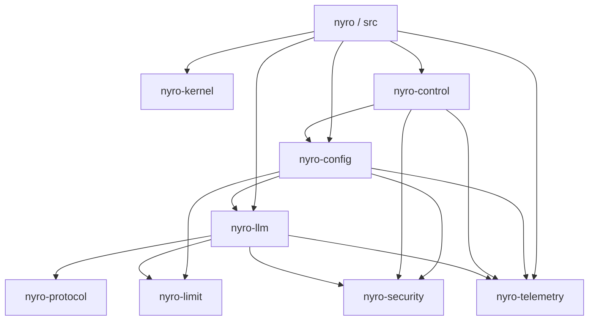

# Nyro Rust 目标架构

> 状态：设计定稿，分阶段实施中；独立内核与首个实验性 standalone LLM 数据面已实现。更新日期：2026-09-08。
>
> 本文是本轮 Rust 重构的目标架构依据，不代表代码已完成迁移。目录树、Rust 类型示例和命令形态均为目标设计；当前实现请查看[现有 workspace](../../Cargo.toml)和本文的现状对应表。

当前已落地独立的 [`nyro-kernel`](../../crates/nyro-kernel/README_CN.md)，以及使用它的实验性源码构建根命令 [`nyro proxy --config`](../standalone/rust-proxy_CN.md)。该命令实现严格文件配置、按授权过滤的模型发现、OpenAI Chat/Embedding、无状态 Responses、Anthropic/Gemini Chat 与跨协议 SSE 子集、多 backend 优先级／加权选择与有界故障转移、认证授权、共享并发限制、模型请求频率限制、累计 token 额度、请求／尝试关联用量观测、Unix SIGHUP 文件配置重载和代际 lease。现有 `nyro-core`、已发布 Server 和 Tauri 请求路径尚未接入该内核；`nyro serve`、`nyro tool`、控制面和其余目标能力仍未实现。

## 1. 产品定位与范围

Nyro 是统一的 AI Gateway，目标是在一个进程内承载 LLM Gateway 和 MCP Gateway。两者是并列的应用，各自拥有协议类型、业务规则和执行流程，共享微内核、控制面及基础能力。

当前范围聚焦 LLM。MCP 仅确定应用边界；Image、Audio、Video 等交互在实际接入时定义，不预建空包、空类型或通用执行框架。LLM 对话里的工具调用不等于已经实现 MCP Gateway。

目标只分发一个 `nyro` 二进制：

| 入口 | 职责 |
|---|---|
| `nyro serve` | 控制面与数据面融合运行，提供管理 API 和 WebUI |
| `nyro proxy` | 只运行数据面，从 standalone 文件或控制面获取配置 |
| `nyro tool` | 承接录制、回放、调试透传和 schema 导出等现有工具能力 |

目标中的 `serve` 与 `proxy` 使用同一套数据面构建和执行流程，区别在于配置来源及是否装配控制面。将来可以按配置启用 LLM、MCP 或两者；当前仅 `nyro proxy --config PATH` 可从源码运行，且只装配 LLM 文件数据面。`serve`、`tool` 和 MCP 仍是目标能力。

## 2. 核心原则

**微内核负责运行一致性，应用负责业务规则，独立能力库负责可复用机制，根程序负责装配。**

- 微内核只管理组件依赖、生命周期、类型化运行代际、发布、请求租约和就绪状态，不理解 LLM、MCP、HTTP、认证、限额、存储或配置文件格式。
- “一切皆模块”表达职责可组合、实现可替换；架构模块不要求与 crate 一一对应，也不要求纯类型、算法和编解码器实现启停接口。
- 模块按能力定义输入、输出和权限。避免把整个 `Gateway`、数据库实体或无约束上下文传给每个模块。
- 共享机制与业务策略分开：授权机制不知道模型或工具的具体业务规则，额度机制不知道模型价格，应用负责这些映射。
- Rust 中优先使用已有依赖和必要的运行时设施，不机械照搬 Go 的标准库限制，也不为目录对称增加抽象。
- 首版模块代码编译进入二进制，由装配层显式选择和注册；配置可以变更模块实例与组合。首版不设计动态库、WASM、插件 ABI 或进程隔离。

## 3. 目标目录树

以下完整展开到 crate 和主要职责模块层级。所有目标路径都是迁移后的组织方案，不是待立即生成的空目录清单。每个 crate 内部继续按实际复杂度拆文件，不按每个策略或每个厂商拆包。

```text
nyro/
├── Cargo.toml                       # 根 package：nyro，同时定义 workspace
├── Cargo.lock
├── AGENTS.md
├── Makefile
├── LICENSE
├── README.md
├── README_CN.md
├── CHANGELOG.md
├── CHANGELOG_CN.md
├── .gitignore
├── .env.example
│
├── src/                             # 唯一产品入口与装配层
│   ├── main.rs
│   ├── cli.rs
│   ├── command/
│   │   ├── mod.rs
│   │   ├── serve.rs
│   │   ├── proxy.rs
│   │   └── tool.rs
│   ├── bootstrap/
│   │   ├── mod.rs
│   │   ├── catalog.rs               # 显式内置能力目录
│   │   ├── candidate.rs             # 应用候选与内核生命周期适配
│   │   ├── reconcile.rs             # 配置变更协调
│   │   └── resource.rs              # 跨代际资源的持有与注入
│   ├── http.rs                      # 通用监听、挂载、健康检查
│   ├── webui.rs                     # 静态资源嵌入与托管
│   ├── shutdown.rs                  # 进程信号与退出协调
│   └── tool/
│       ├── mod.rs
│       ├── record.rs
│       ├── replay.rs
│       ├── passthrough.rs
│       ├── fixture.rs
│       ├── scenario.rs
│       ├── protocol.rs
│       └── schema.rs
│
├── crates/
│   ├── nyro-kernel/
│   │   ├── Cargo.toml
│   │   ├── src/
│   │   │   ├── lib.rs
│   │   │   ├── component.rs         # 组件身份、依赖与生命周期契约
│   │   │   ├── graph.rs             # 依赖校验与确定性顺序
│   │   │   ├── lifecycle.rs         # 启停、回滚与清理
│   │   │   ├── generation.rs        # 类型化代际与请求租约
│   │   │   ├── host.rs              # 激活、发布与退役
│   │   │   ├── status.rs
│   │   │   └── error.rs
│   │   └── tests/
│   ├── nyro-config/
│   │   ├── Cargo.toml
│   │   ├── src/
│   │   │   ├── lib.rs
│   │   │   ├── model.rs             # 组合数据面领域配置
│   │   │   ├── snapshot.rs
│   │   │   ├── validate.rs
│   │   │   ├── fingerprint.rs
│   │   │   ├── source/
│   │   │   │   ├── mod.rs
│   │   │   │   ├── file.rs          # standalone 启动时读取
│   │   │   │   └── remote.rs        # 订阅控制面快照
│   │   │   └── error.rs
│   │   └── tests/
│   ├── nyro-security/
│   │   ├── Cargo.toml
│   │   ├── src/
│   │   │   ├── lib.rs
│   │   │   ├── identity.rs
│   │   │   ├── authn.rs
│   │   │   ├── authz.rs
│   │   │   └── error.rs
│   │   └── tests/
│   ├── nyro-limit/
│   │   ├── Cargo.toml
│   │   ├── src/
│   │   │   ├── lib.rs
│   │   │   ├── rate.rs
│   │   │   ├── quota.rs
│   │   │   ├── concurrency.rs
│   │   │   ├── store.rs             # 限制能力所需的原子状态操作
│   │   │   ├── backend/             # 按实际采用的状态后端实现
│   │   │   └── error.rs
│   │   └── tests/
│   ├── nyro-protocol/
│   │   ├── Cargo.toml
│   │   ├── src/
│   │   │   ├── lib.rs
│   │   │   ├── framing.rs           # 公共流帧处理，不持有网络连接
│   │   │   ├── openai/
│   │   │   │   ├── mod.rs
│   │   │   │   ├── chat.rs
│   │   │   │   ├── responses.rs
│   │   │   │   ├── embedding.rs
│   │   │   │   ├── stream.rs
│   │   │   │   └── error.rs
│   │   │   ├── anthropic/
│   │   │   │   ├── mod.rs
│   │   │   │   ├── message.rs
│   │   │   │   ├── stream.rs
│   │   │   │   └── error.rs
│   │   │   └── gemini/
│   │   │       ├── mod.rs
│   │   │       ├── content.rs
│   │   │       ├── stream.rs
│   │   │       └── error.rs
│   │   └── tests/
│   ├── nyro-llm/
│   │   ├── Cargo.toml
│   │   ├── src/
│   │   │   ├── lib.rs
│   │   │   ├── config.rs            # LLM 自己拥有的配置类型
│   │   │   ├── ir/
│   │   │   │   ├── mod.rs           # Request、Response 枚举及导出
│   │   │   │   ├── chat/
│   │   │   │   │   ├── mod.rs
│   │   │   │   │   ├── request.rs
│   │   │   │   │   ├── response.rs
│   │   │   │   │   ├── stream.rs
│   │   │   │   │   ├── message.rs
│   │   │   │   │   └── tool.rs
│   │   │   │   ├── embedding/
│   │   │   │   │   ├── mod.rs
│   │   │   │   │   ├── request.rs
│   │   │   │   │   └── response.rs
│   │   │   │   ├── content.rs
│   │   │   │   ├── usage.rs
│   │   │   │   ├── metadata.rs
│   │   │   │   ├── extension.rs
│   │   │   │   └── error.rs
│   │   │   ├── codec/              # 基础协议与 LLM IR 的转换
│   │   │   │   ├── mod.rs
│   │   │   │   ├── openai.rs
│   │   │   │   ├── anthropic.rs
│   │   │   │   └── gemini.rs
│   │   │   ├── ingress/
│   │   │   │   ├── mod.rs
│   │   │   │   └── http.rs          # LLM 路由、接入与响应交付
│   │   │   ├── runtime/
│   │   │   │   ├── mod.rs
│   │   │   │   ├── pipeline.rs
│   │   │   │   ├── exchange.rs
│   │   │   │   ├── security.rs
│   │   │   │   ├── admission.rs
│   │   │   │   ├── dispatch.rs
│   │   │   │   ├── retry.rs
│   │   │   │   ├── stream.rs
│   │   │   │   └── finalize.rs
│   │   │   ├── routing/            # 目标选择、负载分配与健康状态
│   │   │   ├── provider/
│   │   │   │   ├── mod.rs
│   │   │   │   ├── driver.rs
│   │   │   │   ├── credential.rs    # 上游凭证，不等同于入站身份
│   │   │   │   ├── metadata.rs
│   │   │   │   ├── common/
│   │   │   │   └── builtin/         # 现有供应商实现按厂商迁入
│   │   │   ├── transport/          # 上游 HTTP 请求与响应流
│   │   │   ├── extension.rs         # 应用扩展契约
│   │   │   ├── observation.rs       # LLM 观测语义
│   │   │   └── error.rs
│   │   └── tests/
│   ├── nyro-control/
│   │   ├── Cargo.toml
│   │   ├── src/
│   │   │   ├── lib.rs
│   │   │   ├── config.rs            # 控制面启动配置，由根程序组装
│   │   │   ├── service/
│   │   │   │   ├── mod.rs
│   │   │   │   ├── provider.rs
│   │   │   │   ├── model.rs
│   │   │   │   ├── api_key.rs
│   │   │   │   ├── setting.rs
│   │   │   │   ├── session.rs
│   │   │   │   ├── oauth.rs
│   │   │   │   └── import_export.rs
│   │   │   ├── http/               # 管理 API 与配置分发端点
│   │   │   ├── publish.rs           # 管理数据转换为配置快照
│   │   │   ├── storage/
│   │   │   │   ├── mod.rs
│   │   │   │   ├── entity.rs
│   │   │   │   ├── repository.rs
│   │   │   │   ├── database/
│   │   │   │   │   ├── mod.rs
│   │   │   │   │   ├── pool.rs
│   │   │   │   │   ├── sqlite.rs
│   │   │   │   │   └── postgres.rs
│   │   │   │   ├── sql/            # 按业务组织查询，保留方言差异
│   │   │   │   ├── migration/
│   │   │   │   │   ├── mod.rs
│   │   │   │   │   ├── sqlite/
│   │   │   │   │   └── postgres/
│   │   │   │   └── memory.rs        # 测试/内存仓储
│   │   │   ├── observation.rs       # 管理日志与统计查询
│   │   │   └── error.rs
│   │   └── tests/
│   └── nyro-telemetry/
│       ├── Cargo.toml
│       ├── src/
│       │   ├── lib.rs
│       │   ├── config.rs
│       │   ├── log.rs
│       │   ├── metric.rs
│       │   └── trace.rs
│       └── tests/
│
├── webui/
│   ├── package.json
│   ├── index.html
│   ├── vite.config.ts
│   ├── public/
│   └── src/
│       ├── main.tsx
│       ├── App.tsx
│       ├── pages/
│       ├── components/
│       ├── hooks/
│       ├── lib/
│       └── assets/
├── tests/
│   ├── common/
│   ├── conftest.py
│   └── e2e/
│       ├── proxy/
│       ├── admin/
│       ├── storage/
│       └── fixtures/
├── pytest.ini
├── requirements-dev.txt
├── docs/
│   ├── design/
│   │   ├── architecture.md
│   │   ├── lifecycle.md
│   │   ├── observability.md
│   │   └── ir/
│   ├── database/
│   │   └── schema.md
│   ├── server/
│   ├── standalone/
│   ├── testing/
│   ├── images/
│   └── release.md
├── deploy/
│   └── schema/
│       └── postgres.sql            # 从迁移源生成的参考 schema
├── scripts/
│   ├── install/
│   └── release/
├── .github/
│   └── workflows/
│       ├── ci.yml
│       ├── storage-backends.yml
│       └── release-server.yml
└── go/                             # 现有 Go 实现与设计参考
```

当前目标是八个能力 crate，加根目录的 `nyro` package。包名采用 `nyro-limit`；不引入 `nyro-provider`、`nyro-llm-types`、`nyro-llm-runtime`、`nyro-plugins`、`nyro-modules` 或通用 `nyro-storage`/`nyro-database` 包。

`crates/nyro-mcp/` 仅作为未来并列应用的位置，不创建、不加入当前 workspace。构建产物、运行数据及开发者本地工具配置未在目标树中展开。已有缓存控制、字段修复、协议扩展等细分实现按职责迁入相应模块，目录合并不表示删除功能。

## 4. 职责与依赖方向

| 包或位置 | 拥有的职责 | 不应承担的职责 |
|---|---|---|
| 根 `src/` | 命令、显式目录、资源注入、候选构建、内核适配、进程退出 | 协议转换、业务 SQL、供应商特殊行为 |
| `nyro-kernel` | 通用组件图、生命周期、代际、租约、就绪状态 | 配置来源、网络协议及所有业务策略 |
| `nyro-config` | 数据面配置组合、解析、快照、校验、指纹、来源 | 启动业务模块、控制面数据库读写 |
| `nyro-security` | 身份、凭证验证、授权契约和通用实现 | HTTP 凭证提取、模型/工具专用权限规则 |
| `nyro-limit` | 频率、累计额度、并发许可及必要状态操作 | 模型价格、协议响应、控制面实体 |
| `nyro-protocol` | 基础 wire 类型、序列化、协议错误与流帧处理 | LLM IR、Provider 凭证、路由、重试 |
| `nyro-llm` | LLM 配置、IR、转换、可信执行、路由、Provider、传输 | 管理数据库、进程装配、MCP 执行规则 |
| `nyro-control` | 管理业务、业务仓储、配置快照发布 | 在请求路径中执行 LLM/MCP 调度 |
| `nyro-telemetry` | 可共享的日志、指标、追踪设施 | 模型计费策略、控制面的业务查询 |

以下箭头表示主要的编译依赖方向；第三方库省略：



领域配置由领域自己定义。`nyro-config` 组合 LLM 和共享能力的数据面配置；它不导入 `nyro-control`。控制面自己的启动配置由根程序组装和传入，避免 `control → config → control` 的循环。LLM 接收自己的配置及已构建资源，不反向依赖产品级快照包。

根程序可以直接引用共享能力包以完成构造和注入。内核与共享库不反向引用根程序；配置、控制面及应用也不通过全局单例访问它。将应用接入内核的生命周期适配留在装配层，独立库可以在不启动内核的情况下使用。

未来 MCP 自己定义配置、请求类型和运行时，消费同一组共享能力；不通过导入 LLM 的请求模型获取认证或限额能力。现阶段不为将来的跨应用业务编排建立 Integration 包。

## 5. 模块契约、嵌套与资源所有权

### 5.1 显式装配与类型化契约

`src/bootstrap/catalog.rs` 显式列出编译进入产品的能力实现。配置选择已存在的实现；引用一个库本身不触发全局注册。目录中的身份、能力种类和构造入口必须匹配宿主要求的契约，未知实现或不支持的组合在候选构建时拒绝。

| 模块类别 | 主要契约 | 生命周期要求 |
|---|---|---|
| 应用运行时 | 自己的配置、类型化请求入口和就绪条件 | 由装配适配器接入组件图 |
| Protocol codec | 特定交互的编解码与流事件能力 | 纯函数/无状态对象不强制启停；流解析状态按请求持有 |
| Provider driver | 供应商扩展、凭证使用、请求准备与错误分类 | 不自行获取整个网关或控制面仓储 |
| 认证、授权、限制实现 | 身份/资源/用量输入及明确结果 | 按状态后端或许可的实际生命周期持有资源 |
| 请求扩展 | 声明的槽位、允许访问的数据和返回结果 | 不拥有必需阶段、重试或最终交付权 |
| 有资源的组件 | 依赖、启动、停止、清理及失败报告 | 构建失败、部分启动和正常退出均有释放路径 |

本文固定职责契约，不预定一套所有模块都必须实现的庞大 trait。首版已有接口和普通类型足够表达的能力，不另建工厂层。

### 5.2 三种关系分别建模

- **配置嵌套关系**：父配置在明确位置选择子能力，例如 LLM 应用选择 Provider、codec 和请求扩展。父模块负责验证子模块的类型、能力与配置组合。
- **资源依赖图**：描述组件启动前需要哪些资源，以及停止时的顺序。共享连接池可以被多个模块使用，不要求复制到每个配置子树。
- **请求执行流程**：由应用规定阶段顺序和数据传递，不由配置树的遍历顺序或模块声明顺序决定。

一个资源只有一个明确的生命周期所有者。使用方持有引用或租约；依赖共享资源不等于取得关闭它的权限。父候选在构建中创建的资源要立即纳入清理范围，后续子模块失败时也能释放。组件按依赖顺序启动，按逆依赖顺序退役；已启动与仅完成构建的资源分别走适当清理路径，避免漏清理或重复清理。

共享库负责关闭自身内部资源的操作；协调何时关闭由持有它的应用或装配层负责。内核只调用通用生命周期契约，不识别数据库、供应商或模型。

## 6. 配置来源与代际生命周期

### 6.1 配置路径

```text
standalone 文件 → nyro-config 解析、校验 ─────────────────┐
                                                        ├→ Snapshot
SQLite / Postgres → 控制面业务读取 → publish 构建、校验 ──┘
                                                             ↓
                           进程内交付或控制面配置分发 → 数据面协调器
```

standalone 在启动时读取文件，Unix 上变更后可显式发送 `SIGHUP` 重载，其他平台需重启；不引入文件自动监听。目标控制面通过配置分发路径驱动在线更新。`serve` 内置的数据面也将消费同样的不可变快照，不在每个模型请求中直接读取管理数据库。

快照保存生效配置，不保存正在变化的许可、计数器、连接和请求状态。有效配置的确定性指纹用于跳过重复更新，不承诺某个序列化格式、hash 算法或 PATCH API。

当前根代理通过 Unix `SIGHUP` 显式读取原文件路径，串行校验并比较有效指纹。监听地址和共享并发容量的不可变性检查先于去重，等价配置不构建候选；有效变更复用根程序持有的共享资源，再交由内核激活。旧请求保持原代际直至响应体清理；文件读取、候选构建或激活失败不替换当前代际。重载等待者持有独立取消 guard，退出或等待被丢弃时显式取消内核拥有的激活工作，避免只丢弃 Future 而遗留配置发布。该入口不提供自动文件监听、Windows 重载或管理 API，rate/quota 规则变更的既有重启约束继续适用。

### 6.2 候选构建与发布

1. 配置来源产生完整快照，完成格式、领域参数和引用关系校验。
2. 比较有效配置指纹；与当前已生效配置一致时跳过重建。
3. 装配层解析能力目录，构建非活动应用候选，注入共享资源并登记候选自有资源。
4. 完成实例级校验和资源依赖图检查；未知依赖、循环依赖或能力不匹配均拒绝候选。
5. 按依赖顺序启动候选组件。候选启动期间不成为活动请求入口；监听和路由挂载由进程层协调。
6. 候选就绪后原子发布。后续新请求取得新代际租约，旧请求继续持有旧代际。
7. 旧代际停止接受新请求，待租约排空后按逆依赖顺序停止和清理。

构建或启动失败时清理候选，保留最后已知有效代际。首次 standalone 激活失败则启动失败；远程来源尚未获得有效快照时，进程可以存活但不就绪，持续等待有效配置。共享资源的健康状态仍独立影响实际就绪状态。

“原子发布”保证活动配置切换的一致性，不代表任意外部副作用可以回滚。启动应尽量避免不可逆副作用；已发送请求、写入的外部数据或产生的费用不能通过回退配置自动撤销。

### 6.3 资源寿命

| 资源 | 主要寿命 | 变更时的要求 |
|---|---|---|
| 不可变快照、配置绑定的运行时与 Driver | 配置代际 | 请求持有期间保持有效 |
| 通用监听、数据库连接池、共享观测设施 | 进程或显式资源作用域 | 候选失败不能关闭仍被活动代际使用的资源 |
| 路由健康状态、限额计数器、并发状态 | 稳定业务身份对应的共享作用域 | 同一身份的配置重建不能意外清零 |
| 网络调用、流解析器、请求上下文 | 请求或单次尝试 | 取消或失败时释放；重试隔离尝试状态 |
| 并发许可、额度预留 | 对应操作 | 与运行代际租约分开管理和收尾 |

资源配置确实变化时，构建新的资源实例并让旧引用排空，不在原地破坏旧代际依赖。退出时先停止接入，再等待请求和清理任务；关闭超时或强制终止必须可观测，不能将未完成的收尾报告为成功。

## 7. LLM 请求执行与扩展权限

### 7.1 固定流程

```text
HTTP 基础接入
  → 获取并固定活动代际
  → 配置相关的领域解码与能力选择
  → Observe → Resolve → Authenticate → Authorize → Admit
  → 可选 PreDispatch → Dispatch → 可选 PostResponse
  → 可信的终态交付 → 逆序 Finalizers
```

接入层先完成与代际无关的基础解析；依赖配置的解码、能力选择和后续执行使用同一个代际。认证身份、截止时间、路由结果、尝试状态和原始传输信息放在请求执行上下文，不扩散为每个 IR 的通用业务字段。

当前已实现模型范围内带稳定 ID 的 backend 列表、优先级与同级加权选择：认证和准入之后，在本地按各 backend 的 codec 准备请求，仅在可表达该请求的可用项之间选择；没有兼容候选时返回请求错误。`max_attempts` 默认 `1`，显式开启后仅对连接建立失败及指定临时 HTTP 错误向其他 backend 故障转移，每个 backend 每请求至多尝试一次。可选的被动健康状态支持失败阈值、冷却和单个恢复探测；状态由根组合层显式跨代际共享，保留在 `nyro-llm`，不进入 kernel。旧单上游 YAML 在解析时归一化，列表顺序不影响配置指纹。完整配置与重试条件见 [Rust proxy 指南](../standalone/rust-proxy_CN.md)。

LLM runtime 掌握必需阶段顺序、最终路由选择、重试预算、流提交状态及终态交付。可选扩展只能在声明槽位继续、拒绝或短路；提前产生结果仍由 runtime 完成协议交付和收尾。扩展不能跳过认证、授权或准入，不能自行调用下一阶段、发送上游请求或写入客户端响应，也不能取消已登记的 Finalizers。

不同交互共享必要机制，但具体执行路径保持请求与响应类型配对。上游是否支持相应工作负载在配置/能力校验及分发时确认，不通过空实现或 `unreachable!` 表达缺失能力。

### 7.2 Codec、Provider 与 Transport

每次上游尝试按以下边界执行：

```text
克隆请求并选择上游模型
  → Provider 扩展领域请求
  → Codec 将 IR 编码为基础 wire 请求
  → Provider 准备 URL、凭证、请求头与签名
  → Transport 发送请求

原始响应
  → Provider 分类原始状态与元数据
  → Codec 解码为 IR 或领域错误
  → Provider 应用供应商响应/错误扩展
  → Runtime 决定交付、重试或故障转移
```

Provider 留在 `nyro-llm/provider`，但其接口只接收执行必需的配置、凭证和类型，不继续传入整个 `Gateway` 或控制面 `Provider` 数据库实体。上游账号授权流程和凭证持久化归控制面，使用凭证和签名归 Provider。

同一协议端点的透明转发需要明确声明兼容能力，并服从同一条认证、准入和交付流程；原始请求保留机制不等于任意扩展字段、凭证或响应头都可以跨协议转发。不支持的转换必须明确处理，不能静默丢弃核心语义。

### 7.3 流、失败与取消

流式响应在首个完整客户端可见帧成功写入并刷新后提交。提交前的缓冲、解析、用量累积和供应商状态按尝试隔离；只有确认客户端尚未收到本次尝试的响应字节、且策略允许时才能重试，并必须丢弃失败尝试的未提交输出。部分写入、写入或刷新失败、以及交付状态不确定时，即使尚未达到完整帧提交点，也禁止重试和切换上游。提交后禁止重试和切换上游，后续错误只能按已提交协议终止当前流。

当前实现采用更早的禁止重试边界：收到上游 `2xx` 后，无论是否已解析首帧或交付客户端，都固定本次尝试。预读首帧只用于响应校验，不代表 HTTP 写入／刷新确认。重试循环不会进入已交付响应体；请求取消和整个期限覆盖所有尝试，单个并发许可保持至响应体完成或释放。

非流式响应在开始向客户端交付后同样不能重新执行上游。客户端断开、超时、正常完成和错误均进入适当收尾路径：取消在途工作，释放并发许可，按已知消耗结算额度，释放代际租约。结算需要异步 I/O 时由运行时显式管理，不能仅依赖同步析构完成。

取消不表示消耗为零；用量缺失也不等于可以退还全部额度。具体预留、结算和失败策略由限制契约及业务策略明确，避免重复结算，并报告无法完成的收尾。

## 8. IR 与协议类型

### 8.1 统一入口与具体工作负载

入口名称由包命名空间区分。以下是目标 IR 的结构示意，`ChatRequest` 等具体类型来自同一包的工作负载模块，并由 `nyro-llm/src/lib.rs` 公开导出：

```rust
pub enum Request {
    Chat(ChatRequest),
    Embedding(EmbeddingRequest),
}

pub enum Response {
    Chat(ChatResponse),
    Embedding(EmbeddingResponse),
}
```

外部使用 `nyro_llm::Request` / `nyro_llm::Response`，或导入包别名后使用 `llm::Request`。统一枚举用于调度边界；Chat codec 和执行路径使用 `ChatRequest` / `ChatResponse`，Embedding 使用 `EmbeddingRequest` / `EmbeddingResponse`。两个入口枚举本身不保证配对，保证来自具体接口。

Chat 流使用自己的事件类型，不要求所有交互实现流接口。当前重点是消除 Embedding 借用空 Chat 消息、把核心字段藏进扩展袋以及响应转换绕过类型契约的问题，不只改入口名称。

### 8.2 内容模态与操作分开

包含图片或音频内容的对话仍然可以是 Chat。图片生成、图片编辑、音频转写、语音合成等操作在需要时定义自己的请求和结果；不能仅按媒体名称制造装满可选字段的万能结构。如果未来的视频操作是异步任务，还应表达任务提交、状态与产物，而非强套普通同步响应。

共享内容引用、错误和用量类型以语义一致为前提。已知的交互核心字段进入类型化 IR；协议特有和供应商特有字段具有明确归属，不把无约束 JSON 作为常规交互数据模型。

### 8.3 对外复用范围

`nyro-protocol` 独立提供 OpenAI、Anthropic、Gemini 基础协议格式，社区项目解析这些协议时不需要构建 Nyro runtime、内核或数据库。IR 与跨协议转换暂留 `nyro-llm`，本次不承诺一个独立的 IR/转换 SDK。Responses 是 OpenAI 族内的一种 API，与 Chat Completions 共享 Chat workload；上游通过 `kind: openai` 加 `api: responses` 选择，不新增 Provider 族或 crate。现有 Chat IR 支持无状态文本、拒绝、客户端函数调用／结果及用量，不能完整承载 Responses 的服务端会话、item 引用、内置工具或 reasoning items，因此本阶段明确拒绝这些语义。具体转换与流状态边界见实验性代理指南。

## 9. 共享安全、限制与观测能力

| 能力 | 共享机制 | 应用负责的语义 |
|---|---|---|
| authn | 凭证验证、身份结果 | 入口凭证提取、身份来源适配 |
| authz | 主体、操作、资源的授权契约 | 模型访问、未来 MCP 工具/资源访问策略 |
| rate | 指定作用域下的频率控制 | 限制对象、阈值和协议拒绝结果 |
| quota | 累计用量、预留和结算 | token/其他计量单位映射及成本策略 |
| concurrency | 在途许可获取与释放 | 受限操作的边界和生命周期 |
| telemetry | 日志、指标、追踪的共享设施 | LLM 或控制面的事件含义和业务查询 |

这些能力同时包含策略与执行机制，不统一归为一个 `policy` 或 `plugins` 大包。`nyro-security` 不预设 `Model`、`RouteID` 等 LLM 字段；`nyro-limit` 不要求所有计量都叫 token。不同工作负载共享实现不自动意味着共享同一额度，作用域由业务配置与映射明确。

当前 rate 实现是 `nyro-limit` 内不含业务键的可克隆令牌桶；LLM 按公开模型映射并共享状态，根程序显式持有跨代际注册表。持续频率与突发容量由模型的可选 `rate` 配置声明。一次逻辑请求在鉴权、并发准入和兼容性准备之后扣减一次，内部重试不重复计数，扣减后失败或取消不退款。超限返回原生协议 `429` 与向上取整的 `Retry-After`，立即释放并发许可。规则不变时配置重建保留余额；已有活跃规则的参数变更要求重启，避免候选构建意外重置计数。当前为进程内频率控制，不提供跨进程共享或持久化；具体语义见 [Rust proxy 指南](../standalone/rust-proxy_CN.md)。

严格累计限额需要考虑并发预留与结算，单纯事前读计数、事后累加不能承诺硬上限。额度状态与并发许可的存储契约必须表达所需的原子性，不能用普通 KV 的 get/set 假定事务成立。

当前 quota 实现为 `nyro-limit` 中按通用单位原子预留与结算的进程内账本，`nyro-llm` 将其映射到公开模型的累计输入加输出 token。模型可选配置 `quota.total_tokens` 与 `quota.reserve_tokens`，每次实际上游尝试前独立预留；完整 JSON／SSE 协议终止后按有效用量结算，连接建立失败全额释放，其他失败、取消、断流和用量缺失按预留与有效已知用量的较大值扣减。上游实际消耗可以超过预留，超额如实记账并阻止后续准入；配置预留不是可信的消耗上界，当前不承诺真实上游 token 硬上限，也不提供金额、持久化或多副本协调。

根程序通过 `nyro_llm::runtime::SharedResources` 显式共享健康、rate 和 quota 注册表。quota 已消耗及在途账本在模型移除／加回后继续保留；有活跃绑定或已消费余额时修改规则会拒绝候选构建，避免配置变更清零。进程重启会重置进程内状态。quota 超限返回原生协议 `429`，不带 `Retry-After` 并立即释放并发许可；其之前的 rate 准入不退款。计量、协议映射和资源组合均未进入 `nyro-kernel`。

观测初始化与资源装配由根程序协调。共享观测实现不认识模型数据库表；控制面的历史日志和统计读取归其业务存储。配置代际租约与限流并发许可是不同概念，不能复用一个计数器代替二者。

当前 LLM 观测语义集中在 `nyro-llm/observation`，复用现有 `tracing`，尚未建立独立 `nyro-telemetry` crate。每个运行时请求生成内部 ID，通过响应头与每次上游尝试的序号关联。上游协议完成或尝试终止时输出一次尝试记录，请求在响应体完成、丢弃或处理 future 取消时输出一次汇总；请求结果与响应体交付结果分开记录，HTTP 错误不会因错误体读完而被视为成功。有效累计用量与 quota 实际扣减分开记录，关闭 quota 也收集用量，缺失／部分／无效用量不冒充完整用量。汇总仅保留固定数量计数器，不累积逐帧事件或响应正文。当前为结构化日志，不提供持久化事件库、查询 API、指标导出或分布式追踪；后续共享设施和控制面可以消费这些语义，内核不参与业务观测。

## 10. 存储与数据库访问

### 10.1 文件来源与数据库仓储

| 方式 | 所在位置 | 语义 |
|---|---|---|
| file / standalone | `nyro-config/src/source/file.rs` | 文件解析、校验、构建不可变配置快照 |
| SQLite | `nyro-control/src/storage/` | 管理数据的持久化与事务 |
| Postgres | `nyro-control/src/storage/` | 与 SQLite 对齐的管理业务存储契约 |
| 内存仓储 | `nyro-control/src/storage/memory.rs` | 测试或内存实现，不等于生产配置文件后端 |

文件不强制实现模型 CRUD、事务和管理 API 写回接口。文件模式不依赖控制面配置数据库；运行期额度和观测状态是否持久化，由各自能力配置决定，不能由“配置来自文件”推断为所有状态均持久化或均不持久化。

### 10.2 SQLite 与 Postgres 操作归属

- `storage/database/`：连接参数、连接池、驱动差异和健康检查。使用已有 SQLx 及必要辅助代码，不创造新的通用数据库操作框架。
- `storage/sql/`：按模型、Provider、API Key、设置、会话等业务组织查询和写入。能够共享的实现继续共享，保留真实的数据库方言差异。
- `storage/repository.rs`：对管理业务提供必要的仓储和事务契约。业务服务决定哪些修改必须一起成功，仓储执行对应事务。
- `storage/migration/`：控制面表结构、迁移源及 schema 校验。通用连接工具不执行任意业务模块的迁移。

根装配层选择后端并持有连接资源，使用者持有连接池引用。候选重建不能关闭仍在使用的共享池。若后续限制模块确实需要自己的 SQL 状态，其查询和 schema 归 `nyro-limit`；只有实际出现共用连接代码时才考虑提取轻量数据库包，不能让限制模块反向依赖控制面。

schema 的所有权不因共用数据库而合并。修改实际迁移源时仍必须遵守仓库的数据库文档与生成流程；参考 SQL 是派生产物，不手写。本轮不修改现有表结构、迁移或生成文件。

## 11. 现有实现与目标对应

采用新旧实现并行开发、最后统一切换入口的迁移方式。新能力包已加入 workspace，且不依赖旧 `nyro-core`；旧入口继续承担现有发布，新实现独立构建和测试。当前已交付独立内核、协议／LLM／配置／安全／并发能力包，以及从严格 YAML 启动的实验性根 `nyro proxy`。接下来仍需补齐现有能力，再接入控制面与工具。

按 PR #323 基线核对的具体差异、后续关闭状态、代码／测试证据与建议顺序见 [Rust 迁移差异审计](rust-migration-gaps.md)。该清单区分现有子集、旧行为兼容取舍和未来扩展，不能仅凭同名功能认定迁移完成。该临时清单在整体迁移完成后连同本处引用删除，不做归档；长期架构与升级说明保留在正式文档中。

阶段进度按“基础落地、兼容对齐、切换验收”区分；同名能力存在不表示旧功能已经等价迁移。

| 阶段 | 当前进度 | 差异跟踪 |
|---|---|---|
| 内核、代际、文件配置 | 基础机制已落地；SIGHUP 重载已有回归 | 后续能力必须保持生命周期与清理约束 |
| LLM 数据面 | 主要执行链已落地；模型发现 G01 已补齐，G02 已支持显式开启 OpenAI Chat 原生 JSON/SSE 保真；整体兼容对齐未完成 | G02–G09 |
| 控制面、存储、管理与持久化观测 | 尚未接入新架构 | G10–G12 |
| 工具、部署和旧入口切换 | 尚未完成切换验收 | G11、G13 |

完成协议与 Provider 回归、流式响应和取消收尾、配置更新、SQLite/Postgres 数据兼容、管理 API/WebUI 及工具命令验证后，再统一切换构建、安装和发布流程，移除 Tauri、旧 Server/Tools 入口及失去消费者的旧代码。旧五阶段 Hook 框架随旧运行时退出，认证、准入、响应处理、终态日志和资源收尾先由新运行时承接。

本表描述迁移归属，不表示独立内核落地时已经执行删除、重命名或兼容切换。

| 当前实现或历史方案 | 目标归属与差异 |
|---|---|
| `crates/nyro-core/` 与整体 `Gateway` | 拆为八个职责包；按使用者注入必要资源，减少全局状态依赖 |
| `src-server/`、`nyro-server --mode ...` | 继续承担现有发布；根 `src/` 已实现实验性文件配置 `nyro proxy`，`nyro serve` 与 `nyro-control` 仍是目标 |
| `src-tauri/`、桌面 IPC、桌面发布工作流 | 退出目标产品形态；WebUI 通过服务端管理 API 工作 |
| `crates/nyro-tools/` 独立工具二进制 | 现有能力迁入唯一二进制的 `nyro tool` 命令族 |
| `crates/nyro-core/src/protocol/ir/` 的 `AiRequest` / `AiResponse` | `nyro-llm` 内入口枚举与 Chat、Embedding 配对类型 |
| 当前协议 codec 中混合的 wire 格式与 IR 转换 | 基础协议进入 `nyro-protocol`，转换留在 `nyro-llm/codec` |
| `crates/nyro-core/src/provider/` | 留在 `nyro-llm/provider`，先消除对整体网关和数据库实体的依赖 |
| 当前 `PluginKernel`、全局注册表与五阶段 Hook 方案 | 微内核只管理资源；应用掌握可信执行；根程序显式装配 |
| 当前 `crates/nyro-core/src/storage/` 与 `src-server/src/yaml_config.rs` | 管理仓储归控制面，文件来源归配置包，领域状态归所属模块 |
| 旧 Rust 的 MySQL 后端及 `deploy/schema/mysql.sql` | 不进入本轮目标支持范围；本轮文档更新不删除实现或生成文件 |
| 当前 `README.md` / `README_CN.md`、运行手册、`AGENTS.md` | 继续说明已发布旧入口，并单独标出实验性源码构建代理及其独立配置格式 |

目标支持范围为 standalone 文件配置、SQLite 和 Postgres。现有 schema、数据和 CLI 的迁移兼容措施属于后续实施计划；本设计不授权删除用户数据或隐式迁移数据库。

## 12. 验收场景与文档维护

以下是整体迁移必须证明的行为。实验性文件代理已经覆盖其中部分内核、请求期限、取消收尾、Chat/Embedding 和 standalone 场景；其余仍是后续验收要求，不能由首个数据面切片推定已经完成：

| 场景 | 验收要求 |
|---|---|
| 候选构造、配置校验或启动失败 | 候选资源清理完整，活动代际不被替换或破坏 |
| 重复有效配置 | 跳过重建，不清零状态、不重复创建资源 |
| 长请求跨配置更新 | 请求保持原代际，新请求使用新代际，旧资源在租约排空后释放 |
| 客户端取消、超时或部分流失败 | 释放许可，执行相应结算，完成或报告清理结果 |
| 扩展拒绝、短路或报错 | 不绕过必需安全阶段，不抑制终态交付及 Finalizers |
| 确认尚无客户端可见输出的上游失败 | 仅在策略允许时重试，失败尝试的未提交输出不泄露 |
| 首帧部分写入、写入/刷新失败或交付状态不确定 | 即使尚未达到完整帧提交点也禁止重试，终止当前交付 |
| 首帧提交后上游失败 | 不重试、不故障转移，按当前协议终止流 |
| Chat 与 Embedding 混合接入 | 具体 codec 和执行路径保持类型配对，不通过虚假流接口适配 |
| standalone 与控制面来源 | 同一有效配置产生一致的数据面行为；文件模式不要求配置数据库 |
| SQLite 与 Postgres 管理操作 | 仓储业务行为与事务要求一致，方言差异由后端承担 |
| 共享协议或安全/限制库的独立引用 | 无须构造整个 Gateway、启动内核或连接控制面数据库 |

本次文档检查包括：八个 crate 名称与目录一致、相对链接有效、依赖图无反向依赖、示例明确是目标 API、旧文档已标记历史范围、上述生命周期场景均有约束。只更新文档时不运行无关 Rust/WebUI 构建，也不生成数据库 schema。

设计参考：[Go 架构](../../go/docs/design/architecture.md)与 [Go 开发约束](../../go/AGENTS.md)。这些资料用于参考职责边界，不自动成为 Rust 的语言级实现限制。Go 目前的部分安全和 quota 接口仍带有 LLM 语义，不能直接当作独立共享库接口照搬。

历史细节参考：[生命周期 RFC](lifecycle.md)、[观测 RFC](observability.md)、[旧 IR 概览](ir/README.md)和[字段归属记录](ir/FIELD_HOMING.md)。它们保留旧架构与历史提案背景；与本文目标架构冲突时以本文为准。当前数据库定义仍以[数据库文档](../database/schema.md)和实际迁移源为准。
