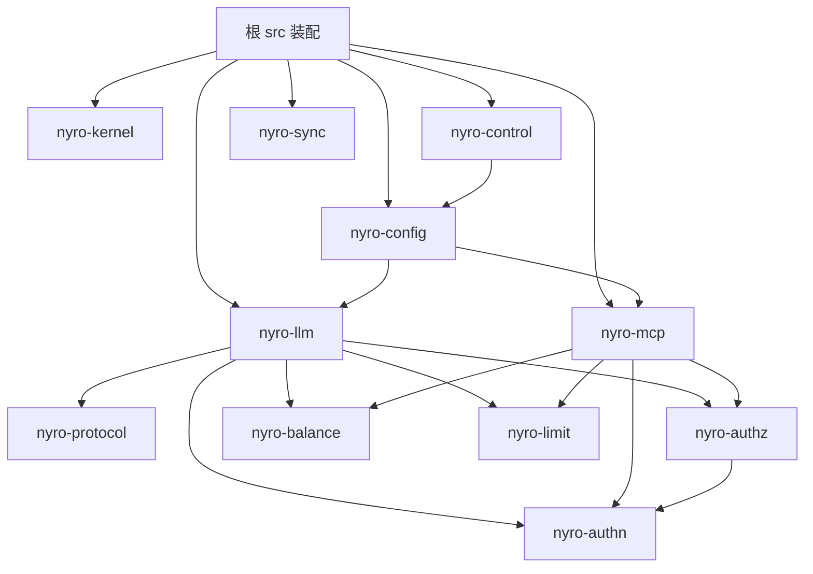

# Rust 网关架构

Nyro 采用微内核与可组合模块。`nyro-kernel` 只管理代际生命周期；业务模块实现认证、授权、限制、上游选择及协议执行；根 `src/` 负责装配和进程入口。这里的模块首先是具有明确依赖边界的 Rust crate，不承诺运行时加载任意动态库。

## 目录与职责

```text
Cargo.toml                 # 根 nyro 二进制及 workspace
src/
  main.rs                  # proxy / serve 命令分派
  serve.rs                 # 启动设置、监听、同步任务和退出
  bootstrap.rs             # 编译资源、构建候选并调用 Host
  gateway.rs               # 组装 LLM 与 MCP
  http.rs                  # 健康、就绪、路由和代际租约
  control.rs               # 管理 HTTP、写入任务、快照分发
crates/
  nyro-kernel/             # 候选、Host、Generation、Lease、退役
  nyro-config/             # 四类公共资源、校验及应用配置编译
  nyro-authn/              # Credential → Identity；出站 key-auth
  nyro-authz/              # Identity / action / resource 授权
  nyro-balance/            # 可复用选择算法和状态，不感知业务
  nyro-limit/
    src/request.rs        # 滚动请求准入接口
    src/token.rs          # 不可变策略、共享窗口、实际用量结算
    src/quota.rs          # 金额配额文档占位，无配置/API
  nyro-protocol/           # 协议线格式和有界帧解析
  nyro-llm/                # LLM 配置、IR、codec、provider、执行
  nyro-mcp/                # MCP 工具代理、访问与生命周期
  nyro-control/            # 持久资源 CRUD、UID、SQLite/Postgres
  nyro-sync/               # 完整快照、memory/HTTP、应用回执
  nyro-tools/              # 协议测试及 schema 导出
```

旧 `nyro-core`、`src-server`、`src-tauri` 和 WebUI 尚有独立消费者。本轮资源/同步调整只切换根源码入口，不切换已发布桌面或 Server，也不改写其数据库。后续迁移差异继续由 [rust-migration-gaps.md](rust-migration-gaps.md) 跟踪；整体切换验收完成后删除该临时清单，不归档。

`nyro-security` 已由 `nyro-authn` 和 `nyro-authz` 替代，不保留空兼容包。Provider 暂留 `nyro-llm` 内部，不增加 provider 或 llm-runtime crate。


```mermaid
flowchart TD
    src[根 src 装配] --> kernel[nyro-kernel]
    src --> config[nyro-config]
    src --> control[nyro-control]
    src --> sync[nyro-sync]
    src --> llm[nyro-llm]
    src --> mcp[nyro-mcp]
    control --> config
    config --> llm
    config --> mcp
    llm --> protocol[nyro-protocol]
    llm --> authn[nyro-authn]
    llm --> authz[nyro-authz]
    mcp --> authn
    mcp --> authz
    llm --> balance[nyro-balance]
    mcp --> balance
    llm --> limit[nyro-limit]
    mcp --> limit
    authz --> authn
```

内核不依赖配置、HTTP、数据库、认证或 LLM/MCP。同步不依赖业务 runtime、内核或数据库；它接收泛型快照及应用回调。数据库只由控制面打开，远程数据面只通过同步获取期望资源。

## 启动与运行资源

启动设置来自 CLI/环境变量；运行配置顶层为 `version: 1`、`upstreams`、`models`、`mcps`、`consumers`。

| 入口 | 行为 |
|---|---|
| `nyro proxy --config …` | 仅数据面；启动读一次文件 |
| `nyro proxy --server …` | 仅数据面；HTTP 长轮询接收完整快照 |
| `nyro serve` | 仅控制面；SQLite/Postgres 保存资源 |
| `nyro serve --enable-proxy` | 控制面与数据面；通过 memory 共用应用循环 |

文件模式没有 SIGHUP、watch 或隐式重载。`serve` 不接收种子配置文件；新库可用空资源启动，管理 API 保存即分发，没有草稿与发布操作。

`upstreams` 是连接和选择池，`models` 与 `mcps` 是公开业务资源，`consumers` 是调用身份。LLM 模型 ID 是请求中的逻辑模型名；MCP ID 决定 `/mcp/{id}`。显示 `name` 与公开 ID 分离。上游目标模型名属于 target。出站认证与 Consumer 凭证分离。

文件不包含内部 UID，启动时按资源类型和公开 ID 建立身份。数据库创建不可变 UID，公开 ID 改名时原子重写引用；同步快照单独携带 UID 映射。计数依赖 UID，不依赖显示名称或密钥。

## 构建、激活与清理

资源先执行纯校验，再编译为 LLM/MCP 内部配置、认证和限制策略。根 Application 复用进程级并发容量、窗口历史、路由历史及上游池状态，构建完整 `GatewayRuntime` 候选，然后调用内核激活。

LLM 与 MCP 总是同时存在于代际中；没有资源时对应运行时为空。新候选失败时保留旧代际。请求取得 Lease，在响应体交付、取消、期限或丢弃后释放。旧代际不被新请求使用，在途请求仍由原代际完成。Reqwest 等客户端通过 RAII 释放；后台任务由根装配负责停止。

详见 [kernel 契约](../../crates/nyro-kernel/README_CN.md)。入口无 `onAccess` / `onLog` 阶段插件机制；Resolve、Authenticate、Authorize、Admit、Execute 是普通业务步骤，观察与清理由作用域和 RAII 保证。

## 认证、授权与限制

`nyro-authn::Authenticator` 是可替换的入站认证接口。多个 key-auth 凭证映射同一 Consumer 身份。出站 key-auth 明确配置 header/query、名称、可选 prefix 和 secret；HTTP 适配器负责应用。OAuth 将来可作为并列实现，不在本轮加入。

访问模式为 anonymous、authenticated、restricted。匿名资源忽略包括错误凭证在内的入站认证；authenticated 要求有效身份；restricted 进一步校验授权。LLM 与 MCP 授权引用各自资源 ID，限制按应用分开计数。

请求和 token 均使用 `{limit, window}` 滚动窗口。资源及 Consumer 限制全部满足才准入。一个逻辑请求只计一次；每个上游尝试按实际已知 usage 结算。重复累计值不重复计费；缺失用量记零，中断仅记最后已知量，并输出不完整状态。没有预占、估算或资源级 rate/concurrency；保留进程级并发保护。

计数仅在单节点内存中。相同 UID、相同窗口调阈值保留历史；新窗口从激活后开始；删除窗口保留尚未过期的历史，在途尝试持有原策略直到结算。候选构建不能修改活跃策略的阈值。金额 quota 等待定价能力后再实现。

## 上游池与协议边界

`nyro-balance` 不感知模型、HTTP、凭证和重试，提供 `weighted-roundrobin`（默认）、`weighted-random`、`least-recent`、`latency-aware`。LLM 负责可表达性、权重、优先级、健康和重试资格；同池模型共享选择历史。MCP 首期只使用前两种策略，单次工具操作固定一个目标，不自动重放。

`nyro-llm::Request` / `Response` 按模块命名空间区分，当前包含 Chat、Embedding。IR 承担可表达的跨协议转换，wire 类型位于 `nyro-protocol`。同协议原生通道与严格转换保留独立边界；协议字段不能安全映射时拒绝或过滤不兼容目标，不能静默丢失语义。更细的 IR 约束见 [IR 文档](ir/README.md)。

MCP 当前为锁定 SDK 的无状态工具子集，不增加目录聚合、会话重放、OAuth 或通用 Agent 网关。具体入口和边界见 [MCP 指南](../standalone/rust-mcp_CN.md)。

## 控制存储和同步

四个业务表为 upstreams/models/mcps/consumers；共同字段 uid/id/name，嵌套字段 JSON，内部引用用 UID。SQLite 使用 TEXT JSON，Postgres 使用 JSONB。schema 元数据只记录结构版本，不是全局配置修订稿。数据库结构与生成方式见 [schema](../database/schema.md)。

写入在控制面串行执行：编辑完整候选 → 校验 → 数据库事务 → 更新内存期望快照 → 通知订阅。事务对小型、有大小上限的资源集合做完整替换，优先保证改名与引用的一致性。调用方断连后已接受的写入继续完成；提交结果不确定时失败关闭并要求重启核对。

`nyro-sync` 使用完整快照、epoch + 单调序号和规范化内容指纹。收到与激活分开记录；重复内容不重建，临时错误退避，永久拒绝版本不忙循环。首次有效配置前 DP 不就绪；合法空配置可就绪；断连继续运行最后内存代际，不提供磁盘离线缓存。

内嵌模式传递类型化对象，不开本机 TCP，也不做 JSON 往返。HTTP 模式为专用凭证的长轮询，远程要求 HTTPS；当前内置服务只绑定回环，由 HTTPS 反向代理终止 TLS。管理、同步与业务凭证分开。当前单控制面所有者不需要服务发现组件；未来 gRPC 等传输仍属于 nyro-sync。

保存成功表示持久化和分发期望状态，不表示所有 DP 同时生效。管理 API 可以查询节点发送、已生效及拒绝状态。完整操作示例见 [数据面](../standalone/rust-proxy_CN.md) 与 [控制面](../standalone/rust-serve_CN.md) 文档。
