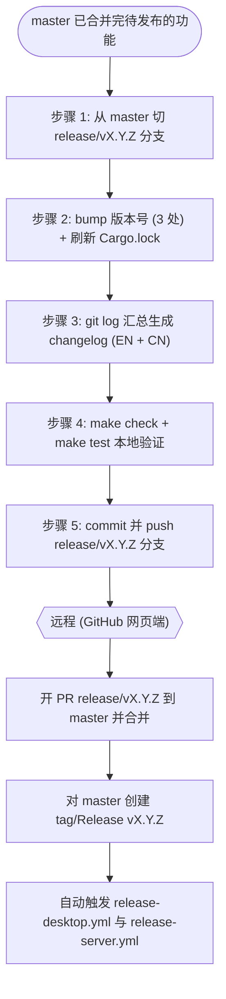

# 发布流程（本地）

本文档描述 Nyro 发布版本时**本地需要完成的工作**。本地负责到「推送 `release/vX.Y.Z` 分支」为止；**PR 合并与打 tag 均在 GitHub 远程完成**。

版本号遵循语义化版本 `vX.Y.Z`（例：`v1.7.6`）。下文以 `vX.Y.Z` 表示目标版本，`X.Y.Z` 表示不带 `v` 前缀的版本号。

## 流程总览



> 虚线之后（PR 合并、打 tag）为远程操作，不在本地执行，此处仅作衔接提示。

## 步骤 1：从 master 切发布分支

```bash
git checkout master
git pull
git checkout -b release/vX.Y.Z
```

## 步骤 2：bump 版本号

手动同步修改以下 **3 处**版本号，保持完全一致：

| 文件 | 字段 |
|------|------|
| `Cargo.toml` | `[workspace.package].version` |
| `src-tauri/tauri.conf.json` | `version` |
| `webui/package.json` | `version` |

随后刷新 `Cargo.lock`（**勿手动编辑**），让 4 个工作区成员 crate 的版本号自动对齐：

```bash
cargo update -w
# 或直接 cargo build / cargo check，亦会刷新 Cargo.lock
```

## 步骤 3：生成并更新 Changelog（核心）

Changelog 内容来源于 **git 自上个版本 tag 以来的所有提交**，归纳总结后写入新版本条目。

1. 收集提交记录：

```bash
git log $(git describe --tags --abbrev=0)..HEAD --no-merges --oneline
```

2. 按以下三类归纳总结，每条带上对应 PR 编号（与现有 Changelog 风格保持一致）：
   - 新功能
   - 改进 / 重构
   - 修复

3. 同步写入两份 Changelog，置于文件顶部最新位置：
   - `CHANGELOG.md`（英文，**canonical**）
   - `CHANGELOG_CN.md`（中文）

参考现有条目格式（版本标题、发布日期、分类小节、`(#PR)` 标注）。两份内容必须对应一致，英文为默认/权威版本。

## 步骤 4：本地验证

执行发布前验证：

```bash
make check
make test
```

确认通过后再继续。

## 步骤 5：提交并推送分支

```bash
git add -A
git commit -m "chore: release vX.Y.Z"
git push -u origin release/vX.Y.Z
```

至此本地工作完成。

## 远程收尾（GitHub 网页端，非本地步骤）

1. 在 GitHub 网页端发起 PR：`release/vX.Y.Z` → `master`，标题 `chore: release vX.Y.Z`，审查后合并。
2. 合并后，在 GitHub 上对 `master` 创建 tag / Release `vX.Y.Z`。
3. 推送 tag 会自动触发以下 workflow（均由 `push tags: v*` 触发）：
   - `.github/workflows/release-desktop.yml`：构建桌面端 bundle、生成 `latest.json`（`scripts/release/gen_latest_json.py`）、创建 GitHub Release、bump Homebrew Cask。
   - `.github/workflows/release-server.yml`：构建各平台 server 二进制。

## 附录：本地变更文件清单

一次发布在本地通常涉及以下文件（参考 PR #185 `release/v1.7.6`）：

| 文件 | 变更内容 |
|------|----------|
| `Cargo.toml` | 工作区版本号 |
| `Cargo.lock` | 随版本号自动刷新 |
| `src-tauri/tauri.conf.json` | 桌面端版本号 |
| `webui/package.json` | WebUI 版本号 |
| `CHANGELOG.md` | 新版本条目（英文） |
| `CHANGELOG_CN.md` | 新版本条目（中文） |
